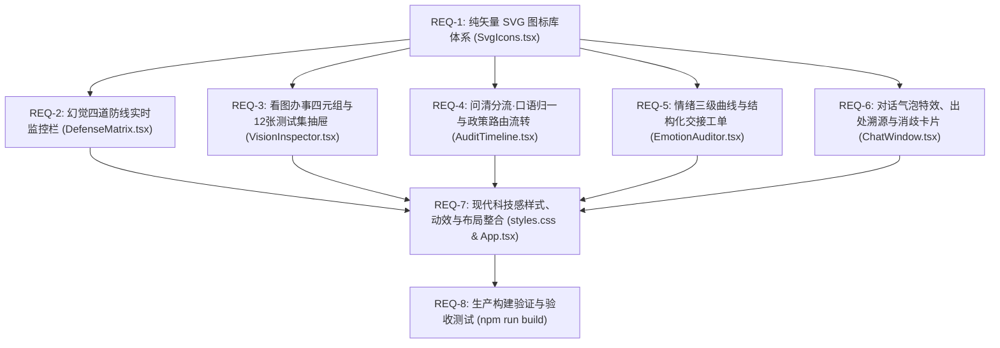

# Anker 智能售后 AI 工作台 · 前端美化与决策看板重构规划

> **本文已完成，是一份历史规划，不是现状说明。** 其中提到的若干组件此后被重写或删除
> （`AuditTimeline.tsx`、`EmotionAuditor.tsx`、`EmotionChart.tsx`、`RetrievalLog.tsx`、
> `HandoffTicketModal.tsx`、`TransferSummary.tsx`、`TaskList.tsx`、`ProductDisambigCard.tsx`），
> 右侧看板也从 4 个 tab 改为三层。要看当前结构请读 `frontend/src/App.tsx` 与
> `docs/V2/03-前端改造清单.md`；契约以 `docs/V2/spec/00-契约冻结.md` 为准。

> **对齐方案**：《Anker首届黑客松挑战赛 · 新航无Bug 预赛材料 V0.3》  
> **设计定位**：从单一聊天框升级为 **「Anker 智能售后 L3 决策与安全审计工作台」**，兼顾消费者真实办理体验与评委后台可解释性审计。  
> **工程标准**：单文件 ≤ 500 行、模块物理隔离、门面聚合导出、全量采用纯矢量 SVG 图标、编译期 0 报错。

---

## 需求点拆解与执行清单 (Requirement Matrix)

### REQ-1: 纯矢量 SVG 图标库体系 (`SvgIcons.tsx`)
- 消除所有 Emoji 与外部依赖，统一高质量 SVG 规范。

### REQ-2: 幻觉四道防线实时监控栏 (`DefenseMatrix.tsx`)
- 流程锁、出处锁、置信度锁、权限锁状态与流转脉冲。

### REQ-3: 看图办事四元组与12张官方测试集抽屉 (`VisionInspector.tsx` & `BenchmarkDrawer.tsx`)
- 四元组参数卡、排障树跳级徽标与 12 张图片评委直选。

### REQ-4: 问清分流 · 口语归一与政策路由流转 (`AuditTimeline.tsx`)
- 口语归一化标签、多意图并行任务流水线、政策路由路径图。

### REQ-5: 情绪三级曲线与结构化交接工单 (`EmotionAuditor.tsx` & `HandoffTicketModal.tsx`)
- SVG 情绪折线图、安抚档位徽章与结构化工单导出卡。

### REQ-6: 对话气泡交互特效与消歧卡片 (`ChatWindow.tsx` & `MessageBubble.tsx`)
- 品牌头像、出处锁条款抽屉、S1 Pro 交互卡片。

### REQ-7: 现代科技感样式、主题与响应式布局 (`styles.css` & `App.tsx`)
- 暗色科技工作台主题、微拟态发光与响应式布局。

### REQ-8: 生产构建验证与验收
- `tsc -b && vite build` 0 errors, 0 warnings。
