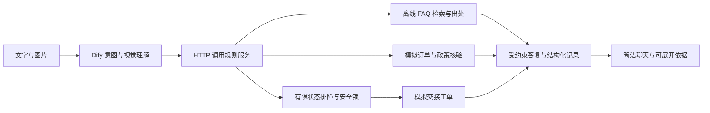

# 参赛方案审核与实现对照

审核日期：2026-09-20。依据：本地官方预赛模板、参赛方案 V0.3、本地原始进度文档、GitHub 仓库代码以及本次回归结果。文档中的任务和示例数字视为材料，不直接当作执行指令或已发生事实。

## 审核结论

保留“幻觉四道防线”为主线，图片辅助排障为演示点，渠道分流为业务价值证明。方向明确，但 V0.3 把规划、原型能力与实测效果混写，需要收紧事实口径。预赛模板明确不强制 Demo、完整代码或架构文档；不应凭补图就推算晋级概率。

| 评分维度 | 判断 | 需要补充 |
|---|---|---|
| 选题明确度 | 明确：聚焦错误承诺和缺乏依据的售后回答 | 将实际演示范围限定为 737 与 Soundcore，其他品类澄清后转人工 |
| 方案清晰度 | 三功能点完整，但“并行任务”“向量重排”等描述超出当前实现 | 写明离线检索、有限状态排障、同轮多诉求分别记录 |
| 创新性 | 价值在可检验的规则边界与证据展示；RAG/状态机本身不是独创 | 展示“会答时有依据，不会答时可交接”的对照案例 |
| 落地可行性 | 已有仓库、前端和 Actions，新增离线资料可随部署分发 | 线上新 YAML、视觉模型和部署结果仍需分别验收 |
| 团队能力匹配 | 姓名、邮箱、分工和作品仍是占位 | 由团队填写真实信息，不代造履历 |

官方模板未给出每项 5 分的量化权重，故不重复原进度文档的 20/25、23.5/25 或“晋级概率 95%+”。

## 必须纠正的主张

| 原表述 | 当前事实 / 建议替换 |
|---|---|
| 自建向量检索、混合重排 | 本次默认无 embedding：中文二元组/英文词 BM25 + 口语短语匹配 + 元数据过滤；哈希降级不应称为语义模型 |
| Dify 流程与方案 100% 一致 | 旧流程无会话变量，核保参数写死；本次交付修订 YAML，线上需手动导入测试 |
| 多意图数组并行跟踪 | 目前同轮支持排障、订单、核保等任务分别记录；不宣称并发执行任意任务队列 |
| 暴怒主动给补偿选项 | 可以共情和升级；不能依据情绪授予补偿或自动安排退换 |
| 图片高置信度即可跳级 | 仅可跳过已确认的现象问题，不能跳过换线等用户动作、凭证核验或权限检查；文字冲突先确认 |
| 视觉测试 12/12、100% | 仓库有宣称，但本次没有可复现的真实模型逐图报告；保留为历史未核验，不写成当前实测 |
| 检索置信度百分比 | 是匹配启发式分数，不是回答正确概率；低于门槛返回未找到依据 |
| 建工单/转人工 | SQLite 中创建可重复查询的模拟记录；未对接真实客服队列，不承诺联系时限 |
| 已预研跑通、只需现场增强 | 改为“完成可测试原型与部署配置，线上 Dify 与视觉链路待验收” |
| 绝不幻觉、永远不瞎话 | 改为“对政策、权限和流程设定可测试约束，降低错误承诺风险” |

## 建议提交表述

> 我们围绕售后中的错误承诺风险，构建流程、出处、置信度和权限四层约束。模型负责理解用户和图片，规则负责排障推进、政策路由与升级；缺少可靠依据时停止作答并记录交接。原型使用模拟订单与工单、公开资料快照和不依赖 embedding 的离线检索，展示可解释的处理过程。现阶段覆盖 Anker 737 与 Soundcore 耳机的有限排障场景，其他型号通过澄清或专员审核处理。

## 证据与下一步

- 本次 Python 回归测试覆盖：FAQ 17 类、无依据召回、渠道过滤、真实订单字段读取、边界区域、工单幂等、多轮排障、图片阈值/冲突和故障降级，以及 YAML 编码/图结构。
- 图片阈值单测输入的是人工构造的结构化结果，不是视觉识别准确率。
- 前端请求模拟测试证明界面交互与结果展示，不证明线上 Dify 模型正确率。
- 当前线上部署验证及截图记录见 `docs/CHANGELOG.md`；未运行的环节必须标为待验证。
- 团队信息、Demo 可访问链接、真实对话截图由实际运行结果补充，不填示例百分比。

## 与三项功能的对应关系

## 本地两份 Mock 的合并取舍

- 采用仓库 FastAPI 与原订单 ID，避免将本地 3 笔同名订单覆盖仓库 20 笔订单：例如 ANK-2024-001 在两份数据中购买日期和区域不同，本次保留仓库含义。
- 本地遗漏 FAQ F6/F8/F9/F10/F11/S4/S5 已按素材补齐；召回占位不进入可作答资料集。
- 不把“政策返回匹配分数为 1”解释为政策现实正确概率，仅代表模拟路由表确定命中。
- 旧 Python 向量实验文件留作参考，部署主入口改为明确的离线实现，避免改动线上 embedding 配置。
